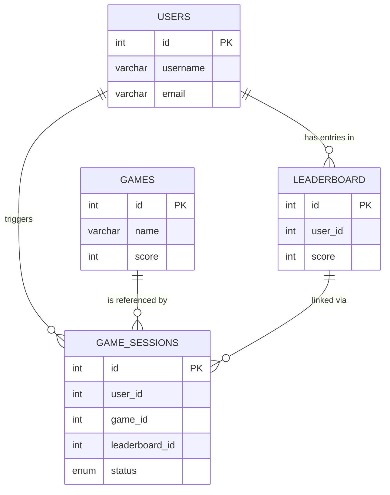
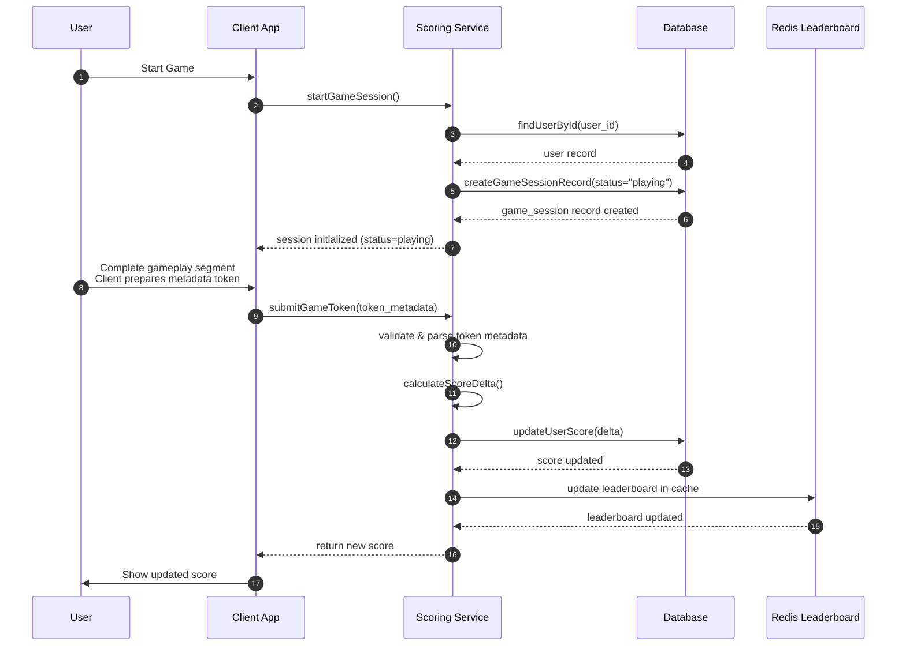

# 📘 Technical Design Document – *Feature Name*

## 1. Overview
A short summary of the feature, the problem it solves, and the expected outcome.

---

## 2. Goals

- Create an API which shows the top 10 user’s scores
- Secure flow to prevent malicious users from increasing scores without authorisation
- Ready to expand to milions requests when system expand and number of user increase fast

---

## 3. Architecture Overview
High-level description of the system and data flow.
### Database Diagram

### User Flow Diagram


### APIs
#### POST /game/start
Request
```
{
    game_id
}
```

#### POST /game/end
Request
```
{
    game_id
}
```
#### Websocket /leaderboard
Request
```
```
Response
```
{
  "leaderboard": [
    { "user_id": 1, "score": 2000 },
    { "user_id": 7, "score": 1920 }
  ]
}

```

## 4. My Oppinion
The solution I suggest above can prevent:
- User start many game at a time (through Scoring Service)
- Always can recaculate for user if fraud detected
- seperate leaboard data to read from cache to avoid hitting DB too much

P/s: Above is my thought when I reading on the problem. Would be beter to here your thought for fraud prevented in your bussiness